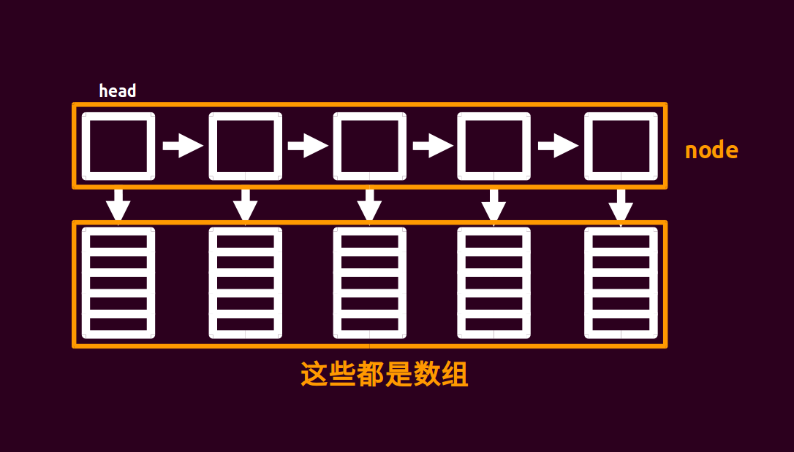

# 块状链表
[](./images/kuaizhuanglianbiao.png "./images/kuaizhuanglianbiao.png")

大概就长这样……

不难发现块状链表就是一个链表，每个节点指向一个数组。
我们把原来长度为n的数组分为 $\sqrt{n}$ 个节点，每个节点对应的数组大小为 $\sqrt{n}$ 。
所以我们这么定义结构体，代码见下。
其中 `sqn` 表示 `sqrt(n)` 即 $\sqrt{n}$，`pb` 表示 `push_back`，即在这个 `node` 中加入一个元素。

```cpp
struct node
{
	node*nxt;int size;char d[(sqn<<1)+5];
	node(){size=0,nxt=NULL,memset(d,0,sizeof(d));}
	void pb(char c){d[size++]=c;}
};
```

块状链表应该至少支持：分裂、插入、查找。
什么是分裂？分裂就是分裂一个 `node`，变成两个小的 `node`，以保证每个 `node` 的大小都接近 $\sqrt{n}$ （否则可能退化成普通数组）。当一个 `node` 的大小超过 $2\times \sqrt{n}$ 时执行分裂操作。

分裂操作怎么做呢？先新建一个节点，再把被分裂的节点的后 $\sqrt{n}$ 个值 `copy` 到新节点，然后把被分裂的节点的后 $\sqrt{n}$ 个值删掉（`size--`），最后把新节点插入到被分裂节点的后面即可。

块状链表的所有操作的复杂度都是 $\sqrt{n}$ 的。

还有一个要说的。
随着元素的插入（或删除），$n$ 会变， $\sqrt{n}$ 也会变。这样块的大小就会变化，我们难道还要每次维护块的大小？

其实不然，把 $\sqrt{n}$ 设置为一个定值即可。比如题目给的范围是 $10^6$，那么 $\sqrt{n}$ 就设置为大小为 $10^3$ 的常量，不用更改它。


```cpp
list<vector<char> > orz_list;
```

## 例题

Big String POJ - 2887

题解：
很简单的模板题。代码如下：

```cpp
#include <cstdio>
#include <cstring>
#include <cctype>
using namespace std;
static const int sqn=1e3;
struct node
{
	node*nxt;int size;char d[(sqn<<1)+5];
	node(){size=0,nxt=NULL;}
	void pb(char c){d[size++]=c;}
}*head=NULL;
char inits[(int)1e6+5];
int llen,q;
void readch(char & ch){do ch=getchar();while(!isalpha(ch));}
void check(node*p)
{
	if(p->size>=(sqn<<1))
	{
		node*q=new node;
		for(int i=sqn;i<p->size;i++)q->pb(p->d[i]);
		p->size=sqn,q->nxt=p->nxt,p->nxt=q;
	}
}
void insert(char c,int pos)
{
	node*p=head;int tot,cnt;
	if(pos>llen++){while(p->nxt!=NULL)p=p->nxt;p->pb(c),check(p);return;}
	for(tot=head->size;p!=NULL&&tot<pos;p=p->nxt,tot+=p->size);
	tot-=p->size,cnt=pos-tot-1;
	for(int i=p->size-1;i>=cnt;i--)p->d[i+1]=p->d[i];
	p->d[cnt]=c,p->size++;
	check(p);
}
char query(int pos)
{
	node*p;int tot,cnt;
	for(p=head,tot=head->size;p!=NULL&&tot<pos;p=p->nxt,tot+=p->size);
	tot-=p->size;return p->d[pos-tot-1];
}
int main()
{
	scanf("%s %d",inits,&q),llen=strlen(inits);
	node*p=new node;head=p;
	for(int i=0;i<llen;i++)
	{
		if(i%sqn==0&&i)p->nxt=new node,p=p->nxt;
		p->pb(inits[i]);
	}
	char a;int k;
	while(q--)
	{
		readch(a);
		if(a=='Q')scanf("%d",&k),printf("%c\n",query(k));
		else readch(a),scanf("%d",&k),insert(a,k);
	}
	return 0;
}
```
